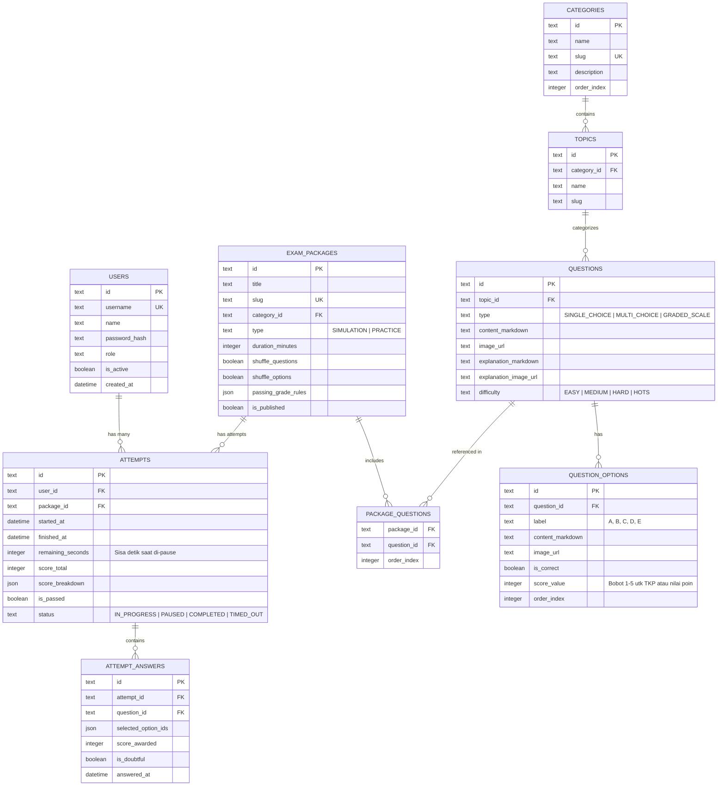

# Product Requirements Document (PRD) — Cerdasify

- **Nama Produk:** Cerdasify
- **Tipe Aplikasi:** Fullstack Web Application (Next.js 16 + PostgreSQL/Supabase)
- **Versi Dokumen:** 1.1.0
- **Status:** Production Ready (Selesai Diimplementasikan)
- **Terakhir Diperbarui:** 2026-10-03

---

## 1. Executive Summary & Visi Produk

**Cerdasify** adalah platform web aplikasi latihan soal dan simulasi ujian terstruktur berkinerja tinggi, dirancang untuk persiapan ujian kompetitif seperti **Olimpiade Sains/Matematika, TKA (Tes Kemampuan Akademik), SNBT/UTBK, dan Seleksi CPNS (SKD/SKB)**.

Aplikasi ini mengusung filosofi **ringan (lightweight), cepat, mobile-friendly**, serta memiliki estetika antarmuka yang bersih, elegan, dan fokus bebas distraksi (*distraction-free testing environment*).

Sistem dirancang sebagai **Closed/Managed System**, di mana manajemen akun peserta dikontrol terpusat oleh Super Admin melalui antarmuka admin atau impor massal CSV/Excel, serta mendukung manajemen bank soal canggih dengan formula matematika (KaTeX/LaTeX), stimulus gambar (*rich media with lightbox*), mode latihan yang bisa dijeda (*pausable practice mode*), dan penilaian bertingkat (seperti TKP CPNS skala 1–5).

Per Oktober 2026 sistem memiliki **1.623 butir soal** dalam **50 paket** (olimpiade Matematika/Sains/Bahasa Inggris PRISMA, CEO, ORION, JSO, KMSI, IMOCSEA, OSN; Buku Soal Sesi; Aljabar Marathon; profiling ASN; Mini CPNS SKD). Bank soal disimpan di repo (`src/db/seed-data/question-bank/`) sebagai sumber kebenaran seeder dan telah diaudit ulang terhadap naskah sumber.

---

## 2. Target Pengguna & Persona

| Peran (Role) | Deskripsi | Kebutuhan Utama |
|---|---|---|
| **Super Admin** | Pengelola sistem utama / pemilik bimbel / koordinator tes | Manajemen bank soal global, impor massal soal & peserta (CSV/Excel), konfigurasi paket ujian, monitoring analitik pengerjaan, manajemen akun & RBAC. |
| **Admin / Pengajar** | Kontributor soal & peninjau konten | Pembuatan & editing soal, upload media stimulus & pembahasan, kurasi bank soal per kategori, validasi kunci jawaban. |
| **Peserta / Siswa** | Siswa olimpiade, peserta bimbel, atau pejuang CPNS/TKA | Mengerjakan latihan mandiri (bisa dijeda & dilanjutkan) & simulasi ujian berbasis waktu, melihat skor instan & analisis pembahasan mendalam, memperbesar gambar soal (lightbox), mengulang paket soal berkali-kali untuk evaluasi progres. |

---

## 3. Fitur Utama & Kebutuhan Fungsional

### 3.1. Bank Soal & Manajemen Soal (Question Engine)
1. **Hierarki Soal & Paket Siap Pakai:**
   - **Kategori Utama:** Olimpiade Sains / Matematika, Buku Soal Standar, CPNS SKD, Aljabar & Matematika Lanjut.
   - **Struktur Paket Soal (50 paket, lihat `DOCS_DEVELOPMENT.md` §9):**
     - *Olimpiade per berkas lomba:* PRISMA, CEO, ORION, JSO, KMSI, IMOCSEA, OSN, latihan Bahasa Inggris Level 1–2.
     - *Paket Standar 40 Butir:* Buku Soal Sesi 1, 2, 3, 4, 5, 13, 21.
     - *Paket Tematik:* Aljabar Marathon 100 Soal, Soal Cerita Tricky, profiling ASN (SJT, kognitif, literasi digital), Mini CPNS SKD.
   - **Tingkat Kesulitan:** Mudah, Sedang, Sulit, HOTS (*Higher Order Thinking Skills*).
2. **Format Soal yang Didukung:**
   - **Pilihan Ganda Standar (A–E):** 1 jawaban benar dengan bobot poin kustom.
   - **Pilihan Ganda Kompleks / Multi-Answer:** Lebih dari satu jawaban benar (model AKM/SNBT).
   - **Soal Berbobot (SJT ASN / TKP CPNS):** Tidak ada benar/salah mutlak; tiap opsi bernilai 1–5 poin sesuai kepatutan tindakan (tanpa nilai minus). Hasil menampilkan perolehan poin per soal dan pembahasan menjelaskan alasan kelima bobot.
   - **Formula Matematika & Simbol Sains:** Rendering penuh LaTeX / KaTeX dan notasi matematika lainnya pada teks soal, seluruh opsi pilihan jawaban (A–E), dan teks pembahasan.
3. **Rich Media & Soal Bergambar (Image Support):**
   - Media gambar pada teks pertanyaan, stimulus diagram/geometri, opsi jawaban, dan penjelasan pembahasan.
   - **API Upload Gambar:** Endpoint `/api/admin/upload-image` di sisi server yang memvalidasi jenis berkas (`image/jpeg`, `image/png`, `image/webp`) dengan batasan ukuran 5MB dan penyimpanan otomatis ke `public/uploads/`.
   - **Fitur Lightbox Zoom:** Peserta dapat mengeklik gambar di kartu soal untuk membukanya dalam modal pembesar layar penuh dengan latar belakang redup (*dim backdrop*), sangat krusial untuk soal geometri, diagram venn, dan grafik koordinat di layar smartphone.
4. **Engine Notasi Matematika & Sains (LaTeX / KaTeX / AsciiMath):**
   - *Inline Math:* Menggunakan tanda dollar tunggal `$f(x) = ax^2 + bx + c$` atau `\( ... \)`.
   - *Display / Block Math:* Menggunakan tanda double dollar `$$\lim_{x \to 0} \frac{\sin x}{x} = 1$$` atau `\[ ... \]`.
   - *Multi-line & Environments:* Persamaan bercabang (`cases`), matriks (`matrix`, `pmatrix`, `bmatrix`), dan sistem persamaan (`aligned`).
   - *Simbol Sains & Rumus Kompleks:* Fraksi (`\frac`), akar bertingkat (`\sqrt[n]{x}`), integral (`\int`), deret & sigma (`\sum`), limit, simbol Yunani, derajat, dan subscript/superscript.
   - *Live Math Preview & Toolbar:* Editor Admin dilengkapi quick-insert button untuk menyisipkan rumus umum tanpa harus menghafal sintaks LaTeX.
   - *Mobile-Responsive & Zero-Crash:* Kontainer formula dilengkapi auto-scroll mendatar dan mekanisme penanganan error yang anggun (*graceful fallback*).
5. **Impor & Ekspor Massal:**
   - Format: Excel (`.xlsx`) dan `.csv`.
   - Engine validasi pra-impor: memvalidasi format kolom, mendeteksi baris rusak, opsi jawaban kosong, dan format bobot salah sebelum data disimpan ke database.
   - Template resmi dapat diunduh langsung di panel admin (`public/templates/`).

### 3.2. Mode Pengerjaan Soal (Testing & Practice Engine)
1. **Mode Latihan Mandiri (Pausable Practice Mode):**
   - Mendukung fitur **Jeda (Pause)** dan **Lanjutkan (Resume)** via endpoint `/api/exam/pause` dan `/api/exam/resume`.
   - **Proteksi Integritas Saat Jeda:** Saat latihan dijeda, sisa waktu tersimpan ke database (`remaining_seconds`), status attempt beralih ke `'PAUSED'`, dan kartu soal di antarmuka client ditutupi tirai pelindung (*screen blackout overlay*) sehingga peserta tidak dapat membaca soal sambil mencari jawaban saat waktu dihentikan.
   - Peserta dapat menekan tombol **Lanjutkan Pengerjaan** kapan saja untuk membuka kembali soal dan melanjutkan timer secara tepat.
   - Pembahasan dan status benar/salah dapat ditelaah setelah pengerjaan selesai.
2. **Mode Simulasi / Ujian (Exam Simulation Mode):**
   - Countdown timer dengan mekanisme sinkronisasi anti-cheat berbasis server time.
   - Antarmuka CAT BKN / UTBK:
     - Nomor soal cepat (*grid navigation*), indikator status (Sudah Dijawab, Ragu-ragu, Belum Dijawab).
     - Tombol "Ragu-ragu" yang dapat difilter.
     - Auto-save jawaban ke database setiap kali peserta memilih opsi (mencegah kehilangan data saat koneksi terputus).
     - Dialog konfirmasi sebelum submit akhir.
     - Auto-submit otomatis ketika durasi habis.
3. **Pengacakan (Randomization):**
   - Opsi acak urutan soal (*Question Shuffle*).
   - Opsi acak urutan opsi jawaban (*Option Shuffle* - dengan tetap memetakan kunci jawaban secara akurat di backend).

### 3.3. Sistem Penilaian Fleksibel (Scoring Engine)
1. **Standar Penilaian CPNS SKD:**
   - **TWK:** Benar = 5, Salah/Kosong = 0 (SKD resmi: ambang 65 untuk 30 soal).
   - **TIU:** Benar = 5, Salah/Kosong = 0 (SKD resmi: ambang 80 untuk 35 soal).
   - **TKP:** Tiap opsi bernilai 1 sampai 5 (SKD resmi: ambang 166 untuk 45 soal).
   - Ambang per paket disesuaikan dengan jumlah soalnya (mis. Mini SKD 1 soal per subtes: TWK 5, TIU 5, TKP 4).
2. **Standar Bobot Skor Kustom (Olimpiade/TKA):**
   - Bobot poin benar kustom (misal: +4), salah (-1 atau 0), kosong (0).
   - Konversi persentase nilai akhir (0–100) dan kalkulasi rata-rata waktu pengerjaan per soal.
3. **Riwayat & Analisis Hasil:**
   - Skor breakdown per kategori/topik.
   - Review lembar jawaban lengkap: kunci jawaban, alasan pembahasan, dan catatan materi dengan formula KaTeX.
   - Riwayat percobaan (*Attempt History*) untuk melihat kurva peningkatan skor.

### 3.4. Manajemen Pengguna & RBAC (User & Security Engine)
1. **Closed Registration Model:**
   - Akun peserta dibuat langsung oleh Super Admin atau via **Impor Peserta Massal** (.xlsx / .csv).
2. **Tingkatan Hak Akses (RBAC):**
   - `SUPER_ADMIN`: Akses penuh sistem, master data, konfigurasi ujian, bank soal, akun pengguna, dan log audit.
   - `ADMIN`: Akses pembuatan soal, kategori, paket, dan statistik.
   - `USER` (Peserta): Mengakses paket latihan/ujian dan riwayat hasil pribadi.

---

## 4. Desain UI/UX & Prinsip Tampilan

1. **Lightweight & Fast-Loading:** Zero unnecessary heavy libraries, performa tinggi di perangkat mobile entry-level.
2. **Mobile-First & Touch-Friendly:**
   - Target sentuh tombol opsi minimal 48px.
   - Drawer ergonomis untuk navigasi daftar nomor soal pada layar ponsel.
   - Sticky action bar bawah (Sebelumnya, Ragu-ragu, Jeda, Selanjutnya, Kumpulkan).
3. **Simpel, Bersih, & Elegan:**
   - Mode Terang dan Mode Gelap OLED-friendly.
   - Modal Lightbox untuk pembesaran gambar stimulus soal secara instan.

---

## 5. Arsitektur Teknis

### 5.1. Tech Stack
- **Framework:** Next.js 16 (App Router, Server Components + Route Handlers).
- **Language:** TypeScript (Strict Mode).
- **Styling:** Tailwind CSS + Lucide Icons + KaTeX CSS.
- **Database:** PostgreSQL (Supabase) via `postgres` + Drizzle ORM, koneksi pooler dengan `prepare: false` dan SSL.
- **ORM / Query Builder:** Drizzle ORM.
- **Authentication & Session:** Session berbasis enkripsi Cookie HttpOnly.
- **Parsing Spreadsheet:** `xlsx` (SheetJS) dan `csv-parse`.
- **Math Rendering:** `katex`.

### 5.2. Skema Relasi Database (Entity Relationship)

---

## 6. Format Dokumen Impor (CSV & Excel)

### 6.1. Spesifikasi Format Impor Soal
1. `kategori` — e.g., "Olimpiade Matematika" atau "CPNS SKD"
2. `topik` — e.g., "Geometri", "Aljabar", atau "TKP"
3. `tipe_soal` — `SINGLE` (Pilihan Ganda Biasa), `SCALE` (Skala Bobot 1–5 CPNS TKP), atau `MULTI`
4. `pertanyaan` — Teks soal (mendukung LaTeX `$...$` atau `$$...$$` dan tag gambar Markdown)
5. `opsi_a` s/d `opsi_e` — Teks opsi pilihan jawaban
6. `kunci_jawaban` — Huruf opsi benar (`A`–`E`) atau bobot `A:3,B:5,C:2,D:4,E:1`
7. `pembahasan` — Penjelasan materi dan langkah penyelesaian matematis
8. `tingkat_kesulitan` — `MUDAH`, `SEDANG`, `SULIT`, atau `HOTS`

### 6.2. Spesifikasi Format Impor Peserta
1. `nama_lengkap` — e.g., "Budi Santoso"
2. `username_atau_email` — e.g., "siswa_budi"
3. `password` — Password awal (di-hash aman dengan bcrypt)
4. `role` — `USER` atau `ADMIN`

---

## 7. Keamanan & Kepatuhan (Security & Integrity)

1. **Proteksi Autentikasi:** Password hashing `bcrypt`, session cookie HttpOnly, proteksi RBAC per rute.
2. **Integritas Ujian (Anti-Cheating Design):**
   - Validasi durasi di server.
   - Kunci jawaban tidak pernah dikirim ke browser peserta saat ujian/latihan aktif berlangsung.
   - Screen privacy overlay otomatis saat pengerjaan dijeda (*pause*).
3. **Keamanan Basis Data:**
   - Query terparameter (Drizzle / tagged template) anti-SQL Injection.
   - Operasi multi-tabel di dalam transaksi; auto-save jawaban memakai upsert atomik.
   - Kredensial database hanya dari environment variable, tidak pernah dicetak ke log.
4. **Validasi File Upload:**
   - Ukuran unggahan dibatasi maksimal 5MB.
   - Whitelist MIME type gambar (`image/jpeg`, `image/png`, `image/webp`).

---

## 8. Milestone & Status Implementasi

| Fase | Deskripsi | Status | Catatan |
|---|---|---|---|
| **Phase 1** | Foundation & Database Setup (Next.js, Drizzle, PostgreSQL) | ✅ Selesai | Migrasi idempoten & transaksi atomik |
| **Phase 2** | Authentication & RBAC (HttpOnly Session, Middleware) | ✅ Selesai | 3 Akun Role Awal aktif |
| **Phase 3** | Bank Soal, KaTeX Engine & Import (Excel/CSV) | ✅ Selesai | Live Math Toolbar & Template resmi siap unduh |
| **Phase 4** | Exam Engine (Simulasi & Latihan, Auto-Save, Grid CAT) | ✅ Selesai | Navigasi interaktif responsif mobile |
| **Phase 5** | Scoring, Analytics & History | ✅ Selesai | Review pembahasan & kalkulasi skor server-side |
| **Phase 6** | Polish & Real Question Extraction | ✅ Selesai | 492 butir soal awal ter-extract dari dokumen Olimpiade & Buku Soal |
| **Phase 7** | Rich Media & Pausable Practice Mode | ✅ Selesai | Upload gambar, Lightbox zoom, dan Pause & Resume aktif |
| **Phase 8** | Audit Bank Soal & Seeder Kanonik | ✅ Selesai | 1.623 soal diaudit terhadap naskah sumber; bank soal kanonik + `npm run bank:export`; soal berbobot SJT diperbaiki |

