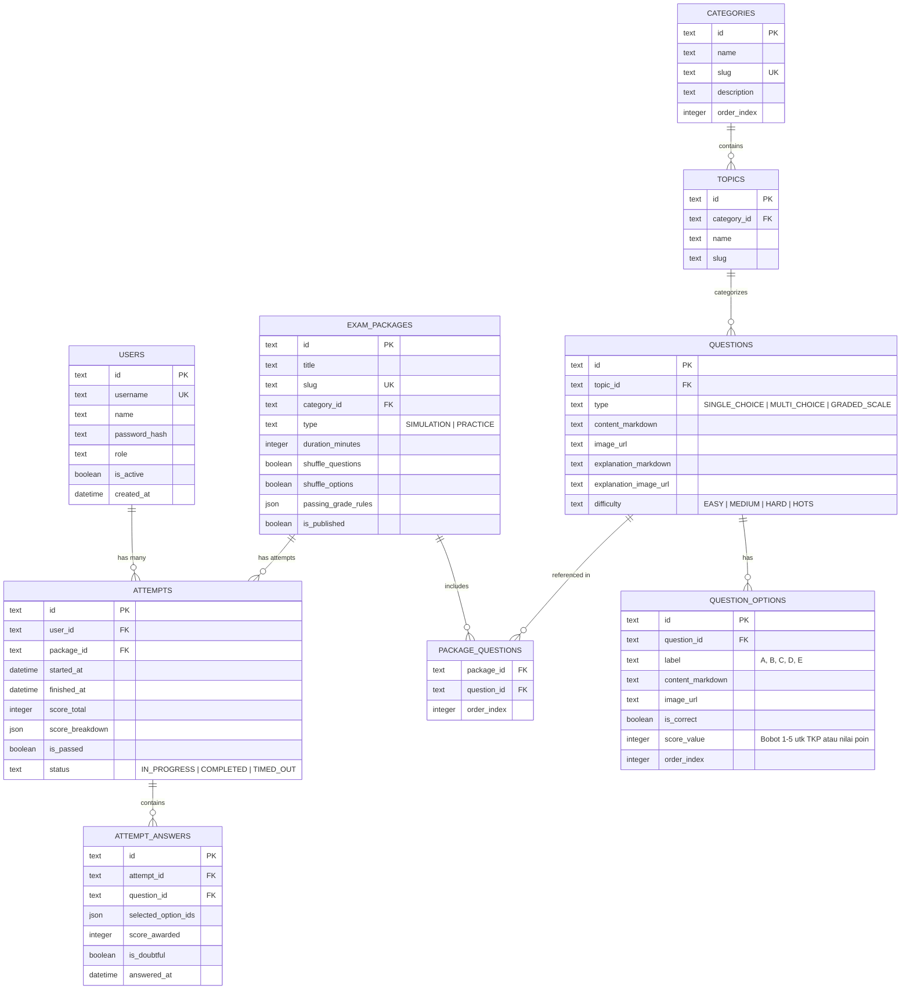

# Product Requirements Document (PRD) — Cerdasify

- **Nama Produk:** Cerdasify
- **Tipe Aplikasi:** Fullstack Web Application (Next.js + SQLite WAL Mode)
- **Versi Dokumen:** 1.0.0
- **Status:** Draft Disetujui
- **Terakhir Diperbarui:** 2026-10-03

---

## 1. Executive Summary & Visi Produk

**Cerdasify** adalah platform web aplikasi latihan soal dan simulasi ujian terstruktur berkinerja tinggi, dirancang untuk persiapan ujian kompetitif seperti **Olimpiade Sains/Matematika, TKA (Tes Kemampuan Akademik), SNBT/UTBK, dan Seleksi CPNS (SKD/SKB)**.

Aplikasi ini mengusung filosofi **ringan (lightweight), cepat, mobile-friendly**, serta memiliki estetika antarmuka yang bersih, elegan, dan fokus bebas distraksi (*distraction-free testing environment*).

Sistem dirancang sebagai **Closed/Managed System**, di mana manajemen akun peserta dikontrol terpusat oleh Super Admin melalui antarmuka admin atau impor massal CSV/Excel, serta mendukung manajemen bank soal canggih dengan formula matematika (KaTeX/LaTeX), gambar, dan penilaian bertingkat (seperti TKP CPNS skala 1–5).

---

## 2. Target Pengguna & Persona

| Peran (Role) | Deskripsi | Kebutuhan Utama |
|---|---|---|
| **Super Admin** | Pengelola sistem utama / pemilik bimbel / koordinator tes | Manajemen bank soal global, impor massal soal & peserta (CSV/Excel), konfigurasi paket ujian, monitoring analitik pengerjaan, manajemen akun & RBAC. |
| **Admin / Pengajar** | Kontributor soal & peninjau konten | Pembuatan & editing soal, upload media pembahasan, kurasi bank soal per kategori, validasi kunci jawaban. |
| **Peserta / Siswa** | Siswa olimpiade, peserta bimbel, atau pejuang CPNS/TKA | Mengerjakan latihan mandiri & simulasi ujian berbasis waktu, melihat skor instan & analisis pembahasan mendalam, mengulang paket soal berkali-kali untuk evaluasi progres. |

---

## 3. Fitur Utama & Kebutuhan Fungsional

### 3.1. Bank Soal & Manajemen Soal (Question Engine)
1. **Hierarki Soal:**
   - **Kategori Utama:** e.g., CPNS SKD, Olimpiade Sains, UTBK-SNBT, TKA Saintek/Soshum.
   - **Subkategori / Topik:** e.g., TWK (Tes Wawasan Kebangsaan), TIU (Tes Inteligensia Umum), TKP (Tes Karakteristik Pribadi), Matematika Diskrit, Fisika Mekanika.
   - **Tingkat Kesulitan:** Mudah, Sedang, Sulit, HOTS (*Higher Order Thinking Skills*).
   - **Tagging:** Multi-tag untuk fleksibilitas pencarian.
2. **Format Soal yang Didukung:**
   - **Pilihan Ganda Standar (A–E):** 1 jawaban benar dengan bobot poin kustom.
   - **Pilihan Ganda Kompleks / Multi-Answer:** Lebih dari satu jawaban benar (model AKM/SNBT).
   - **Soal Bobot Skala Bertingkat (CPNS TKP):** Tiap opsi jawaban memiliki nilai 1–5 (tidak ada jawaban bernilai 0).
   - **Formula Matematika & Simbol Sains:** Rendering LaTeX / KaTeX di soal, pilihan, maupun pembahasan.
   - **Rich Media:** Dukungan gambar pada stimulus soal, opsi pilihan, dan gambar penjelasan pembahasan.
3. **Impor & Ekspor Massal:**
   - Format: Excel (`.xlsx`) dan `.csv`.
   - Engine validasi pra-impor: memvalidasi format kolom, mendeteksi baris rusak, opsi jawaban kosong, dan format bobot salah sebelum data disimpan ke database.
   - Halaman khusus **Panduan Format Impor & Download Template Resmi**.
4. **Fitur Bank Soal:**
   - Pencarian cerdas, filter multi-kategori, duplikasi paket soal, arsip soal, dan statistik tingkat kesulitan.

### 3.2. Mode Pengerjaan Soal (Testing & Practice Engine)
1. **Mode Latihan Mandiri (Self-Study Mode):**
   - Bebas durasi waktu.
   - Pembahasan dan status benar/salah dapat dicek langsung setelah menjawab.
   - Opsi ulangi pengerjaan (*unlimited retakes*) dengan perbandingan riwayat skor.
2. **Mode Simulasi / Ujian (Exam Simulation Mode):**
   - Countdown timer dengan mekanisme sinkronisasi anti-cheat berbasis server time.
   - Antarmuka ala CAT BKN / UTBK:
     - Nomor soal cepat (*grid navigation*), indikator status (Sudah Dijawab, Ragu-ragu, Belum Dijawab).
     - Tombol "Ragu-ragu" yang dapat difilter.
     - Auto-save jawaban ke database setiap kali peserta memilih opsi (mencegah kehilangan data saat koneksi terputus).
     - Dialog konfirmasi sebelum submit akhir.
     - Auto-submit otomatis ketika durasi habis.
3. **Pengacakan (Randomization):**
   - Opsi acak urutan soal (*Question Shuffle*).
   - Opsi acak urutan opsi jawaban (*Option Shuffle* - dengan tetap memetakan kunci jawaban secara akurat di backend).
   - Opsi pengambilan sampel acak dari bank soal (misal: ambil 30 soal acak dari 100 soal dalam kategori TIU).

### 3.3. Sistem Penilaian Fleksibel (Scoring Engine)
1. **Standar Penilaian CPNS SKD:**
   - **TWK:** Benar = 5, Salah/Kosong = 0 (Passing Grade kustom, default misal: 65).
   - **TIU:** Benar = 5, Salah/Kosong = 0 (Passing Grade kustom, default misal: 80).
   - **TKP:** Tiap opsi bernilai 1 sampai 5 (Passing Grade kustom, default misal: 166).
   - Penentuan status: **MEMENUHI AMBANG BATAS (LULUS PG)** atau **TIDAK MEMENUHI AMBANG BATAS**.
2. **Standar Bobot Skor Kustom (Olimpiade/TKA):**
   - Bobot poin benar kustom (misal: +4), salah (-1 atau 0), kosong (0).
   - Konversi persentase nilai akhir (0–100) dan kalkulasi rata-rata waktu pengerjaan per soal.
3. **Riwayat & Analisis Hasil:**
   - Skor breakdown per kategori/topik.
   - Review lembar jawaban lengkap: kunci jawaban, alasan pembahasan, dan catatan materi.
   - Riwayat percobaan (*Attempt History*) untuk melihat kurva peningkatan skor.

### 3.4. Manajemen Pengguna & RBAC (User & Security Engine)
1. **Closed Registration Model:**
   - Tidak ada pendaftaran umum publik tanpa izin.
   - Super Admin dapat membuat akun satu per satu atau melakukan **Impor Peserta Massal** melalui file Excel/CSV (berisi Nama, Email/Username, Password default, Role, dan Kategori Kelas/Grup).
   - Fitur reset password dan nonaktifkan akun peserta oleh Super Admin.
2. **Tingkatan Hak Akses (RBAC):**
   - `SUPER_ADMIN`: Akses penuh ke seluruh sistem, master data, konfigurasi ujian, bank soal, akun pengguna, dan log audit.
   - `ADMIN`: Akses ke pembuatan soal, kategori, dan melihat analitik peserta.
   - `USER` (Peserta): Hanya dapat melihat paket soal yang ditugaskan/tersedia, mengerjakan ujian, dan melihat riwayat hasil pribadinya.

---

## 4. Desain UI/UX & Prinsip Tampilan

1. **Lightweight & Fast-Loading:** Zero unnecessary heavy libraries, asset optimasi tinggi, performa skor Google Lighthouse 95+ di Mobile dan Desktop.
2. **Mobile-First & Touch-Friendly:**
   - Target sentuh (tap target) tombol opsi jawaban minimal 48px.
   - Bottom sheet / Drawer yang ergonomis untuk navigasi daftar nomor soal pada layar ponsel.
   - Sticky action bar bawah (Sebelumnya, Ragu-ragu, Selanjutnya).
3. **Simpel, Bersih, & Elegan:**
   - Tipografi modern (Geist / Inter) dengan kontras warna yang nyaman untuk membaca teks panjang soal.
   - Mode Terang (Clean Minimalist) dan dukungan Mode Gelap (OLED-friendly dark mode) yang tidak melelahkan mata saat ujian malam hari.
   - Math rendering mulus tanpa lonjakan layout (*zero Cumulative Layout Shift*).

---

## 5. Arsitektur Teknis

### 5.1. Tech Stack
- **Framework:** Next.js (App Router, React 19 / Server Components + Route Handlers).
- **Language:** TypeScript (Strict Mode).
- **Styling:** Tailwind CSS + Lucide Icons + KaTeX CSS.
- **Database:** SQLite (menggunakan driver performa tinggi `better-sqlite3`).
- **Database Mode:** WAL (Write-Ahead Logging) dengan setting optimal:
  ```sql
  PRAGMA journal_mode = WAL;
  PRAGMA synchronous = NORMAL;
  PRAGMA busy_timeout = 5000;
  PRAGMA foreign_keys = ON;
  PRAGMA cache_size = -64000; -- 64MB memory cache
  ```
- **ORM / Query Builder:** Drizzle ORM (type-safe, zero overhead, dukungan migrasi teruji).
- **Authentication & Session:** Session berbasis enkripsi Cookie HttpOnly (`iron-session` atau token terverifikasi aman), tanpa ketergantungan pihak ketiga.
- **Parsing Spreadsheet:** `xlsx` (SheetJS) dan `csv-parse` untuk parsing berkas upload di sisi server.
- **Math Rendering:** `katex` (SSR / fast client rendering).

### 5.2. Skema Relasi Database (Entity Relationship)



---

## 6. Format Dokumen Impor (CSV & Excel)

### 6.1. Spesifikasi Format Impor Soal
Kolom wajib pada template:
1. `kategori` — e.g., "CPNS SKD"
2. `topik` — e.g., "TIU", "TWK", atau "TKP"
3. `tipe_soal` — `SINGLE` (Pilihan Ganda Biasa), `SCALE` (Skala Bobot 1–5 CPNS TKP), atau `MULTI` (Multi-Jawaban)
4. `pertanyaan` — Teks soal (mendukung format LaTeX dengan `$...$` atau `$$...$$`)
5. `opsi_a` — Teks opsi A
6. `opsi_b` — Teks opsi B
7. `opsi_c` — Teks opsi C
8. `opsi_d` — Teks opsi D
9. `opsi_e` — Teks opsi E (opsional jika 4 pilihan)
10. `kunci_jawaban` — Huruf opsi benar (`A`, `B`, `C`, `D`, atau `E`). Untuk tipe `SCALE` (TKP), format bobot nilai: `A:3,B:5,C:2,D:4,E:1`
11. `pembahasan` — Penjelasan materi dan langkah penyelesaian
12. `tingkat_kesulitan` — `MUDAH`, `SEDANG`, `SULIT`, atau `HOTS`

### 6.2. Spesifikasi Format Impor Peserta
1. `nama_lengkap` — e.g., "Budi Santoso"
2. `username_atau_email` — e.g., "budi.cpns@gmail.com" atau "peserta_01"
3. `password` — Password awal (akan di-hash aman dengan bcrypt/argon2 di server)
4. `role` — `USER` atau `ADMIN`

---

## 7. Keamanan & Kepatuhan (Security & Integrity)

1. **Proteksi Autentikasi:**
   - Password hashing standar industri (`bcrypt` dengan cost factor 12 atau `argon2id`).
   - Session Cookies HttpOnly, Secure, SameSite=Lax.
   - Proteksi brute-force login dengan rate limiter di Route Handler.
2. **Integritas Ujian (Anti-Cheating Design):**
   - Validasi batas waktu pengerjaan di server (jawaban yang disubmit melewati toleransi toleransi jaringan pasca-timer habis akan diabaikan).
   - Kunci jawaban tidak pernah dikirim ke frontend selama sesi ujian berlangsung (hanya ID pertanyaan dan opsi yang dikirim ke browser peserta).
   - Nilai dan pembahasan hanya di-generate di server saat status attempt berstatus `COMPLETED`.
3. **Keamanan Basis Data SQLite WAL:**
   - Menggunakan Prepared Statements untuk seluruh operasi query (kebal dari SQL Injection).
   - Penanganan konkurensi dengan `PRAGMA busy_timeout = 5000` mencegah error `database is locked`.
   - File `.sqlite` diletakkan di luar folder public (`./data/cerdasify.db`) dan tidak dapat diakses langsung via HTTP.
4. **Validasi File Upload:**
   - Batasan ukuran berkas import maksimal 5MB.
   - Pengecekan MIME type berkas sebelum parsing.
   - Sanitasi teks input untuk mencegah serangan Stored XSS.

---

## 8. Milestone & Rencana Implementasi

1. **Phase 1: Foundation & Database Setup**
   - Setup project Next.js TypeScript, Tailwind CSS, Drizzle ORM, SQLite WAL mode.
   - Migrasi skema database & seeder akun Super Admin default.
2. **Phase 2: Authentication & RBAC**
   - Engine autentikasi aman berbasis cookie HttpOnly.
   - Middleware otorisasi halaman berdasarkan role (Super Admin, Admin, User).
3. **Phase 3: Bank Soal & Import Engine**
   - CRUD Kategori, Topik, dan Soal dengan preview KaTeX.
   - Parser Excel & CSV, validator baris, dan generator template unduhan.
4. **Phase 4: Exam & Practice Engine**
   - Antarmuka simulasi pengerjaan soal responsif & hemat memori.
   - Auto-save jawaban, navigasi grid nomor, dan penanganan timeout.
5. **Phase 5: Scoring, Analytics & History**
   - Kalkulasi skor TKP (bobot bertingkat) dan passing grade CPNS/TKA.
   - Halaman hasil ujian, analisis topik kelemahan, dan rekap ranking.
6. **Phase 6: Testing, Polish & Hardening**
   - Uji coba performa mobile, audit aksesibilitas, dan verifikasi konkurensi database WAL.
